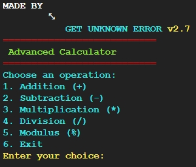

# C++ Calculator

This repository contains a simple C++ calculator program that can be automatically compiled and run using the provided scripts.





## How to Use

### Unix-based Systems

1. Clone the repository:
    ```sh
    git clone https://github.com/GET-UNKNOWN-ERR0R/Calculator.git
    cd Calculator
    ```

2. Run the program:
    ```sh
    ./run.sh
    ```

### Windows

1. Clone the repository:
    ```sh
    git clone https://github.com/GET-UNKNOWN-ERR0R/Calculator.git
    cd Calculator
    ```

2. Run the program:
    ```bat
    run.bat
    ```

### GitHub Actions

The C++ program will also be automatically compiled and run using GitHub Actions when you push changes to the repository.

## License

This project is licensed under the MIT License - see the [LICENSE](LICENSE) file for details.
